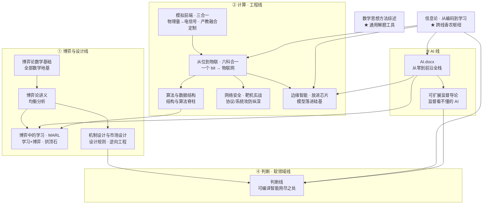

# 图书馆 · Library

> 这不是一堆资料，而是一座经过设计的建筑。四条主线——**博弈与设计 · 计算工程 · AI · 判断软领域**——各自承重，又在交汇处被焊到一起：`信息论`作跨线枢纽贯穿三域，`数学思想方法综述`作通用工具浸润全馆。各书馆内只教一次、后书回指前书、零前置缺口，咬合如一本而非孤立的综述。

**约 410 万字　·　14 部文档（13 部核心馆藏 + 1 部产教融合定制）　·　8.3 万余个内嵌公式**

它最不寻常的地方，是替自己留了一道收束：前十二部把"可编译的智能"用到极致，第十三部《判断线》转身，标出它失效的地方。

---

## 🗺️ 四条主线 · 一张坐标系

十三部书在一栋建筑里各就其位。先认坐标，再读书：

- **地基—承重墙—拱顶石（① 博弈与设计线）**：`博弈论数学基础`浇筑地基，`博弈论讲义`砌起均衡分析的承重墙，`博弈中的学习与 MARL`是三线合龙的拱顶石，`机制设计与市场设计`从设计侧反向支撑（让均衡实现目标）。
- **脊柱（② 计算 · 工程线）**：`模拟前端 · 三合一`从物理量换能到电信号、补上数字之前的模拟/物理前端（产教融合定制），`从位到物联 · 六科合一`是从一个比特连续攀升到物联网的全栈脊柱，`算法与数据结构`补齐结构脊骨，`网络安全 · 靶机实战`是同一套协议与系统的攻防纵深，`边缘智能 · 把模型放进芯片`把模型落进硅基。
- **承重墙（③ AI 线）**：`AI.docx`是机器学习到大模型的全栈承重墙，`可扩展监督导论`续接其上。
- **合龙的脊柱（④ 判断 · 软领域线）**：`判断线 · 在可编译的智能用尽之处`以五张面孔焊回前三线——这是全馆唯一焊接关系的权威陈述，五处用尽各接回它所反思的那几本（逐一对应见 [§ 把全馆读成一个论证](#-把全馆读成一个论证) B 段）。

> **枢纽**　`信息论 · 从编码到学习`——熵是这座馆的通用货币，同一套语言同时托起通信编码、机器学习损失与博弈中的信息价值，是三条线共用却各书只各讲一面的香农底座。
>
> **工具**　`数学思想方法综述`——化归 / 构造 / 对偶 / 不变量 / 递推，贯穿各书的解题招式。

---

## 📚 目录

| 文档 | 在路线中的角色 | 层 | 规模 | 内嵌公式 | 大小 |
|------|------|:---:|------|:---:|:---:|
| [数学思想方法综述_公式版.docx](数学思想方法综述_公式版.docx) | 跨学科的**通用工具** | `0 · 元工具` | 约 16 万字 | 1,010 | 0.27 MB |
| [博弈论数学基础.docx](博弈论数学基础.docx) | 博弈线的**数学地基** | `1 · 地基` | 约 34 万字 · 21 章 / 4 卷 | 16,876 | 2.3 MB |
| [博弈论讲义.docx](博弈论讲义.docx) | 博弈线的**均衡分析** | `2 · 主体层` | 约 85 万字 | 14,524 | 2.1 MB |
| [博弈中的学习与多智能体强化学习.docx](博弈中的学习与多智能体强化学习.docx) | 三线交汇的**拱顶石** | `2 · 主体层` | 约 35 万字 · 20 章 / 4 卷 | 12,558 | 1.1 MB |
| [机制设计与市场设计.docx](机制设计与市场设计.docx) | 博弈线的**设计侧**（逆向工程） | `2 · 主体层` | 约 35 万字 · 17 章 / 4 卷 | 12,466 | 0.81 MB |
| [从物理量到电信号_三合一.docx](从物理量到电信号_三合一.docx) | 模拟/物理**前端**（产教融合定制） | `2 · 主体层` | 约 12 万字 · 12 章 / 3 卷 | 2,107 | 0.30 MB |
| [从位到物联_六科合一_全书.docx](从位到物联_六科合一_全书.docx) | 计算工程线的**全栈脊柱** | `2 · 主体层` | 约 59 万字 · 31 章 / 4 卷 | 8,306 | 2.6 MB |
| [算法与数据结构.docx](算法与数据结构.docx) | 计算线的**结构与算法脊柱**（三件套） | `2 · 主体层` | 约 22 万字 · 17 章 / 4 卷 | 6,857 | 0.71 MB |
| [网络安全_从原理到靶机实战.docx](网络安全_从原理到靶机实战.docx) | 协议与系统的**攻防纵深**（授权实操） | `2 · 主体层` | 约 22 万字 · 22 章 / 5 卷 | 59 | 0.52 MB |
| [边缘智能：把模型放进芯片.docx](边缘智能：把模型放进芯片.docx) | 模型落进硅基的**工程合龙**（TinyML） | `2 · 主体层` | 约 14 万字 · 11 章 / 3 卷 | 568 | 0.40 MB |
| [AI.docx](AI.docx) | AI 线的**全栈承重墙** | `2 · 主体层` | 约 17 万字 · 16 章 | 787 | 0.30 MB |
| [可扩展监督导论——非专家的AI验证方法.docx](可扩展监督导论——非专家的AI验证方法.docx) | 人机协作的**方法论** | `2 · 主体层` | 约 19 万字 · 7 章 | — | 0.42 MB |
| [信息论_从编码到学习.docx](信息论_从编码到学习.docx) | 三条线共用的**香农枢纽** | `3 · 跨线枢纽` | 约 18 万字 · 13 章 / 3 卷 | 7,511 | 0.51 MB |
| [判断线——在可编译的智能用尽之处.docx](判断线——在可编译的智能用尽之处.docx) | **第四条线**·判断/软领域（焊接全馆） | `4 · 软领域` | 约 30 万字 · 29 章 / 5 卷 | 6 | 0.55 MB |

---

## 🧬 把全馆读成一个论证

把这十三本当成**一本**来读，它讲的是同一件事——**知识能被编译到什么程度，又在哪里编译不动。** 下面是这个论证的三段。

### A · 它为什么是一座馆，而非十三本书

三条工程纪律，把书堆变成一个相互咬合的系统：

- **馆内只教一次**——每个概念只在归属之书讲一遍，别处只回指、不重讲。P/NP 在《博弈论数学基础》讲一次，《算法与数据结构》《可扩展监督导论》直接回指其框架。
- **零前置缺口**——全馆是一张无环依赖图（DAG）；任何后置概念出现前，它的前置都已在更早处讲过，读者不会撞上凭空出现的术语。
- **焊接而非并列**——每本书的收口章显式写出它与上游 / 对偶之书的接口：ARP 在《从位到物联》讲一次、《网络安全》把它升级为攻防；《机制设计》是《博弈论讲义》的逆问题；《边缘智能》是《从位到物联》与《AI》的合龙；《判断线》接回它所反思的每一本。

这三条合起来，就是把"知识"当作可被**无缝编译**的对象——而这恰是全馆要回头审视的前提。

### B · 把它读成一条链：十三个内核，一个主旨

知识点会忘，**核心思想**才是带得走的"思维操作系统"。这条链以信息论为大前提（命题性的世界里知识可被编码、压缩、传输到熵极限），前十二本为小前提（那次编译的实际执行），判断线为结论。顺着链读，每一格给一个可迁移内核、一个本→本的串联点、一句生活泛化：

| 书 | 可迁移内核 | 本→本的串联点 | 一句生活泛化 |
|---|---|---|---|
| **博弈论数学基础** | 直觉只有被逼成可证明的命题才算真懂 | 直觉 → 形式化 → 存在性证明 | 严谨是把"模糊的相信"逐层降解到不可再质疑的地基 |
| **博弈论讲义** | 理性的人停在谁都不愿单方面改变的均衡 | 规则 → 效用最大化 → 均衡 | 预判系统走向，别问"应该怎样"，问"哪个状态没人愿先动" |
| **机制设计与市场设计** | 先定结果再倒推规则，让人自愿走到那里 | 目标 → 约束（激励相容）→ 机制 | 想改变行为，改激励与规则，而非说教 |
| **博弈中的学习与 MARL** | 最优是被学习动力学演化出来的，不是一次算出来的 | 学习（更新）→ 遗憾（尺）→ 收敛/震荡 | 面对重复决策，不求每步最优，只求长期不后悔 |
| **从位到物联** | 复杂＝简单的分层组合，中间没有魔法 | 抽象层 → 接口 → 组合 | 抓住"它建在哪层之上、对外露出什么接口"，任何系统都能逐层拆开 |
| **算法与数据结构** | 选对结构，难题变易题 | 数据结构 → 复杂度（尺）→ 正确性（证明） | 很多"难"是结构没摆对，时间与空间总在互相赎买 |
| **网络安全 · 靶机实战** | 每个漏洞的根，都是某个隐含假设被违反 | 假设 → 违反（攻击）→ 加固 | 真正的安全感来自把隐含假设显式化 |
| **边缘智能 · 把模型放进芯片** | 为约束而重新设计，而非把云端模型缩小 | 约束 → 压缩 → 权衡（精度 vs 资源） | 约束不是敌人，是逼出创新的起点 |
| **AI.docx** | 智能＝从数据拟合函数、用梯度优化一个目标 | 表示 → 目标（损失）→ 优化 | 你优化什么，你就成为什么 |
| **可扩展监督导论** | 验证 ≠ 理解——不懂它怎么做，也能判断它对不对 | 验证 ↔ 理解 → 可观察现象（现实/一致性/目标） | 验证比理解便宜得多（验算 ≪ 求解） |
| **信息论 · 从编码到学习** | 熵是不确定性的货币；能压缩 ＝ 抓到规律 ＝ 理解 | 熵 → 编码（压到极限）→ 容量（传的极限） | 一条消息的价值，在它消除了你多少不确定 |
| **数学思想方法综述** | 解难题＝把它变形成一个你已经会的问题 | 化归 → 不变量 → 对偶 | 学习的杠杆在"招式"层，不在"知识点"层 |
| **判断线 · 用尽之处** | 判断，是在可编译的聪明用尽之处接手的能力 | 可编译 → 用尽处 → 判断 | AI 越强，越凸显人在规则失效、价值冲突时的不可替代 |

博弈与设计线的四格，合起来是"**在给定约束下，让决策尽量逼近最优**"的正、逆、动态三面：讲义正向求解均衡、机制设计逆向设计规则、学习动态逼近。两点最该带走——**效用函数就是把"你看重什么"量化成的一把价值尺**；而真正可用的往往不是求全局最优（现实里你几乎算不动），是 **剔劣 + 选优**：剔掉你能判断出的劣策略、抓住你能力范围内的占优策略，反复迭代，常能把一团乱麻收敛到很小、甚至唯一。承认"能力范围内"这条边界，恰好呼应第四条线：判断，正是在分析能力用尽之处接手。

而《判断线》把"用尽"拆成五处，逐一接回馆藏，五卷各取一种：

- **规则**用尽处：实践智慧（Phronesis）——规则不完备 + 价值冲突时凭什么判断；接回机制设计 / 可扩展监督。
- **模型**用尽处：不确定性下的判断——真不确定性≠风险、生态理性、肥尾与脆弱性；接回博弈论 / 信息论 / 博弈中的学习。
- **计算**用尽处：情绪、身体与判断——临门一脚为何是身体在投票（躯体标记 / 内感受 / 共情）；接回 AI.docx。
- **编译**用尽处：知识的边界——默会 × 范式 × 分布式的不可中央编译，整馆的"自我意识"章；接回信息论 / 可扩展监督。
- **理想化**用尽处：战略与权力的现实主义——形式博弈接地为真实权力（谁有资格设定规则），全书总收口；接回博弈论讲义 / 机制设计。

而它对真正不可编译的部分诚实止步：

> 本书只做"可综述的那半张地图"：品格 / 苦难（斯多葛）与文学（陀思妥耶夫斯基）刻意不做成教材——它们靠实践与经历获得，综述它们是范畴错误。这条诚实的边界，本身就是全书论点的兑现。

### C · 链尾：终点是自知，非全知

顺下来，这条链的锋芒是"可编译的智能"的全部——而判断线接在它的尽头，只追问一句：**可压缩，是有边界的。** 于是一个主旨浮现：把"可编译的智能"用到极致，再诚实地交出它用尽的地方。前者是 AI 正在迅速商品化的聪明，后者是人不可替代的另一半。

所以这座馆的终点是"自知"而非"全知"：把能编译的编译到顶，又精确标出编译到哪里为止。而最深的那道边界，《判断线》早用一句话点破——

> **你眼中的你不是你， 别人眼中的你也不是你， 你眼中的别人才是你。**

当认知的对象是人自己时，世上并没有一份"客观原件"供你编译：你触及的永远是自己的建构，连"他人"也是你内心的投影。信息论能把万物的规律压缩到熵的极限，却压不动这面镜子。

---

## 📖 文档简介

按攀登顺序，从工具到自省，十三段＝登楼的十三级。每段先一记短断言，再给机制与它在主线上焊住的那道缝。

**博弈与设计线**

### 数学思想方法综述

**它不是又一本教材，是一部元教材。**——《高等数学、线性代数、概率论与数理统计及离散数学中的数学思想方法综述》（公式版），约 16 万字，不复述定理而抽取贯穿高数 / 线代 / 概率统计 / 离散的可迁移思想方法（化归、构造、对偶、不变量、递推），即解题者真正反复复用的那层招式；1,010 处公式已逐一校订为 Word 原生公式。

### 博弈论数学基础

**全馆公式最密集的一部。**——16,876 个公式，也是整条博弈线的数学地基；多数博弈论教材默认读者已备好所需数学却从不讲它，本书反其道而行，从副标题"从形式基础到平均场前沿"起亲手浇筑博弈论暗中依赖的全部数学，21 章 / 4 卷构成一道由地基向尖顶上升的剖面。

展开四卷细目

- 卷一 · 形式基础与三大支柱：数理逻辑与证明方法、集合关系与函数、初等组合与计数、线性代数、多元微积分、初等概率。
- 卷二 · 分析、凸性与优化引擎：实分析与度量空间、凸分析、点集拓扑与不动点定理、非线性规划与 KKT、线性规划与对偶。
- 卷三 · 概率深化、动力系统与序格：测度论概率、随机过程、常微分方程与 Lyapunov 稳定性、偏序/格/Tarski 与 Topkis。
- 卷四 · 离散计算与连续时间前沿：组合数学与图论、计算复杂性（PPAD / 无悔学习）、最优控制与变分法、偏微分方程（HJB / Fokker–Planck / 粘性解）、随机分析（Itô / SDE）、平均场博弈（MFG）。

### 博弈论讲义

**全馆体量最大的单卷。**——约 85 万字、14,524 个公式；若说《博弈论数学基础》提供工具，本书就是用这套工具回答博弈论的核心追问——给定一组规则，理性的参与者会落在哪个均衡，系统铺陈从博弈建模到均衡分析的完整体系，其下游正是《博弈中的学习》（当参与者会学习时，均衡如何动态地达成或失稳）。

### 博弈中的学习与多智能体强化学习

**全馆的拱顶石——三条线在此合龙。**——它把《博弈论数学基础》的数学、《博弈论讲义》的均衡理论、《AI.docx》的深度学习栈，在"学习 × 博弈"的交汇点焊成一体，20 章 / 4 卷、约 35 万字、12,558 个原生公式，并以 17 条承重定理全证回答一个统一问题：当多个会学习的智能体相互作用时，会收敛到什么、为什么、怎么算。

展开四卷细目

- 卷一 · 在线学习与遗憾（第 1–4 章）：专家建议与乘性权重（MW/Hedge）、在线凸优化（OGD/FTRL/镜像下降）、多臂老虎机（UCB/Thompson/EXP3）。
- 卷二 · 博弈中的学习（第 5–9 章）：虚拟博弈、无悔学习→粗相关/相关均衡、遗憾匹配与 CFR、学习动力学的收敛与不收敛、零和博弈的最优化解法。
- 卷三 · 强化学习（第 10–15 章）：MDP 与贝尔曼方程、动态规划、无模型方法（MC/TD/Q-learning）、深度 RL、策略梯度与信赖域、样本复杂度与探索。
- 卷四 · 多智能体（第 16–20 章）：随机博弈（Shapley 值迭代）、MARL 范式（CTDE/值分解/MAPPO）、通信与信用分配、平均场 RL、LLM 智能体与博弈。

### 机制设计与市场设计

**博弈论的逆向工程。**——《博弈论讲义》分析"给定规则会落在哪个均衡"，本书反问"想让某结果成为均衡、该设计什么规则"，17 章 / 4 卷、约 35 万字、12,466 个原生公式；设计者的问题一以贯之——在激励相容 / 个体理性 / 可行性三类约束下实现目标，显示原理是贯穿全书的元工具，数学工具直接回指《博弈论数学基础》与《从位到物联》（Gale–Shapley）。

展开四卷细目

- 卷一 · 社会选择与机制设计基础（第 1–4 章）：Arrow 与 Gibbard–Satterthwaite 不可能定理、显示原理、VCG 机制。
- 卷二 · 拍卖理论（第 5–8 章）：四大拍卖与收益等价、Myerson 最优拍卖、组合拍卖、Myerson–Satterthwaite 双边交易不可能。
- 卷三 · 无钱市场：匹配与分配（第 9–12 章）：稳定匹配的格结构与延迟接受（DA）、顶点交易循环（TTC）、学校选择、公平分割（租金分割与 Sperner）。
- 卷四 · 信息·合约·计算（第 13–17 章）：贝叶斯说服与信息设计、委托代理合约、算法机制设计、市场设计工程学与设计者工具箱总图。

**计算 · 工程线**

### 从物理量到电信号 · 三合一（模拟前端 · 产教融合定制）

**同一个 PN 结，既测信号、又取能量。**——为机电学院微电子专业**产教融合定制**（贴着馆藏方法做的应用案例，故列于核心馆藏之外），把模拟电子电路、传感器原理与检测技术、太阳能电池技术三门课贯通成一本，约 12 万字、12 章 / 3 卷、1,696 个原生公式。脊柱是"物理量 ⇄ 电信号"的**模拟前端**：模拟电路加工信号、传感检测换能测准、太阳能电池把同一半导体换能从"信号"切到"能量"；合龙点是同一个 PN 结——做信号换能器是光电传感器、做能量换能器是太阳能电池。重动手是生命线（每电路配可仿真网表、每电池给 I-V 实测表、**性能实测不编造**），三态①②③不混；向上接回《从位到物联》的 ADC——补上全馆计算工程线缺失的模拟/物理前端一段。

### 从位到物联 · 六科合一

**学科的边界是行政的，不是真实的。**——离散数学、数字逻辑、计算机、单片机、网络、物联网通常是六本书、六门考试，本书主张底下只有一条从"位（bit）"连续攀升到"物联网"的技术栈，约 59 万字（全馆体量第二）、8,306 个原生公式，把六科熔成一条主线，跨学科的公共模块（数制、状态机、图论、编码）只在归属章讲一次、各科按需回指。

展开四卷细目

- 卷一 · 公共地基与离散工具库（第 1–8 章）：数制与数据表示、布尔代数、组合计数与计算复杂度、有限状态机与自动机、图论与图算法、数论与有限域编码等离散数学工具。
- 卷二 · 数字逻辑与计算机系统脊柱（第 9–18 章）：组合/时序逻辑、存储器与时序、PLD/FPGA、指令集（ISA）、数据通路与 CPU、流水线、Cache 与存储层次、I/O 与中断、操作系统基础。
- 卷三 · 单片机与数据通信桥梁（第 19–23 章）：MCU 架构、GPIO、外设与通信。
- 卷四 · 网络与物联网前沿：从数据通信走向物联网应用。

### 算法与数据结构

**补上六科自陈的那块缺口。**——《从位到物联》在终章自承"数据结构未能独立成科"，本书补上这一块并立成脊柱，约 22 万字、17 章 / 4 卷、6,857 个原生公式；不是结构罗列，而有一条贯穿全书的三件套纪律——每个数据结构 / 算法都交出正确性证明 + 复杂度证明 + 可运行实现（可编译 C 与可运行 Python 双实现、注释不变量），面向研究生 / 408 水平。

展开四卷细目

- 卷一 · 基础结构与分析（第 1–4 章）：摊还分析三法（聚合 / 记账 / 势能）、线性表与栈队列、字符串匹配（KMP）、树与遍历、Huffman 编码。
- 卷二 · 查找与排序（第 5–9 章）：BST→AVL→红黑树→B 树的平衡演进、散列与布隆过滤器（期望分析）、快排期望、排序下界、选择与中位数的中位数。
- 卷三 · 图算法与设计范式（第 10–14 章）：BFS/DFS 定理、拓扑排序、强连通分量（Tarjan）、最短路、最小生成树、网络流（Dinic）、分治、动态规划、贪心与拟阵。
- 卷四 · 极限与应对（第 15–17 章）：NP 完全性与归约实战（回指《博弈论数学基础》P/NP 框架）、近似（2-近似）/ 随机化（Karger）/ 启发式、算法工程学与全书综合。

### 网络安全 · 从原理到靶机实战

**懂一个系统怎么坏，才真懂它怎么对。**——同一套网络栈与系统，从攻击者与防御者两个视角各看一遍，约 22 万字、22 章 / 5 卷，每个漏洞讲清"为什么存在、怎么利用、怎么防"；面向授权渗透测试、CTF 与防御，全书贯穿四条红线（授权与隔离、攻防对称、不越武器化红线、命令真实但环境值占位不编造），协议/系统底座回指《从位到物联》。

展开五卷细目

- 卷一 · 实验室与方法论（第 1–3 章）：杀伤链与 ATT&CK、搭建隔离靶场（全书实操底座）、PTES/OSSTMM 与授权范围 RoE。
- 卷二 · 侦察与网络攻防（第 4–7 章）：OSINT、Nmap 扫描机理、Wireshark 与 ARP 欺骗/中间人、网络层攻击。
- 卷三 · Web 应用安全（第 8–12 章）：Burp/OWASP、SQL 注入与命令注入、XSS/CSRF/SSRF、认证会话与 LFI/上传、进阶 Web。
- 卷四 · 系统攻防与后渗透（第 13–18 章）：密码学攻击、二进制栈溢出与缓解机制、Linux/Windows 提权、Metasploit 全链路、后渗透（蓝队检测视角）。
- 卷五 · 防御、专题与综合（第 19–22 章）：蓝队检测工程、加固与纵深防御、IoT/无线/云专题、综合实战 capstone（完整 kill-chain + 渗透报告）。

### 边缘智能 · 把模型放进芯片

**边缘不是缩小版的云。**——《从位到物联》给出躯体（MCU / 传感器 / 协议），《AI.docx》给出大脑（模型），本书合上两书都没合的那道缝：怎么把一个动辄数 MB 的模型，真正装进只有几百 KB SRAM、靠电池供电的芯片里，约 14 万字、11 章 / 3 卷；论点是延迟 / 功耗 / 内存 / 隐私四条物理约束逼出的重新设计，重动手是生命线——每个机制都配最小可跑代码、性能一律实测填表。

展开三卷细目

- 卷一 · 约束与压缩：让模型变小（第 1–4 章）：四大约束与资源账本（Flash/SRAM/FLOPs 核算）、量化深讲（定点数学与 INT8 推理，讲到能手算）、剪枝 / 知识蒸馏 / 低秩分解。
- 卷二 · 推理引擎与工程（第 5–8 章）：剖析 TFLite Micro 与 CMSIS-NN、一个完整的 KWS 关键词唤醒项目走通"训练→转换→量化→烧录→四维实测"、音频 / 视觉 / IMU 三类传感器、DSP/NPU/GPU/FPGA 加速硬件谱系。
- 卷三 · 协同与收官（第 9–11 章）：端-边-云协同（任务切分 / MQTT / OTA，回指《从位到物联》）、联邦学习与隐私（FedAvg 一轮手算），终章 capstone 给温湿度 IoT 系统装上异常检测的"大脑"，端侧推理 + 云端再训练 + OTA 下发闭环。

**AI 线**

### AI.docx

**一部从零到前沿的全栈纵览。**——《从零到前沿：人工智能、大模型、机器学习、深度学习与神经网络全栈知识体系》，约 17 万字、16 章，把整张 AI 地图按一条上升路线铺开（数学基础 → 优化 → 经典机器学习 → 神经网络 → 深度学习架构 → Transformer 与大模型 → 训练对齐 → RAG 与智能体 → 多模态 → 生成模型 → 强化学习 → MLOps 与治理）；787 处公式均为 Word 原生公式，其中曾被生成器损坏的 Bellman 方程、GAN/VAE/WGAN 目标、扩散损失等已按标准形式逐一重建并独立复核。

### 可扩展监督导论 · 非专家的 AI 验证方法

**外行能监督自己看不懂的 AI。**——副标题 *Introduction to Scalable Oversight — The Non-Expert's Approach*，约 19 万字、7 章，是全馆唯一的方法论 / 人侧技能读本，也是最反直觉的一部；办法是把不可理解的断言翻译成可观察的现象——验证 ≠ 理解，外行手里有三种不依赖领域知识的硬通货（现实 / 一致性 / 目标），并配一套六步领域无关动作集作实操内核，是 ARBITER-UPRK 协议的人侧对偶（刻意不堆公式，故内嵌公式为 0）。

展开七章细目

- 第 1–3 章：核心框架（脊柱章）→ 问题根源（为何不能直接信 AI：幻觉 / 谄媚 / 自纠失败，与人的"知识的诅咒"）→ 理论地基（验证为何远便宜于理解：P/NP 直觉与证明者-校验者博弈）。
- 第 4 章：AI 侧范式——把 debate / iterated amplification / weak-to-strong / prover-verifier 翻译成"小白可执行版"。
- 第 5 章（实操核心）：人侧六步动作集（角色反转 / 预测前置 / 验收外包 / 矛盾三角测量 / 递归分解 / 残差显式化），逐一配真实案例与可直接抄用的模板。
- 第 6–7 章：前端的意图定义与提示（验收先行）→ 教学法（把验证者角色当可迁移技能来训练，含给教师的练习设计与评估 rubric）。

**跨线枢纽**

### 信息论 · 从编码到学习

**三条线都站在同一个人的肩上。**——《从位到物联》在讲 CRC 与纠错码、《AI.docx》在讲交叉熵与信息瓶颈、《博弈论讲义》在讲信息的价值，本书论证它们站在 1948 年香农以"熵"为核心的同一套语言之上，约 18 万字、13 章 / 3 卷、7,511 个原生公式；脊柱是一条从"度量"到"极限"再到"枢纽"的主线，每个定理都标注馆藏落点、三态（完整证明 / 陈述见文献 / 直觉示意）不混。

展开三卷细目

- 卷一 · 度量信息：熵的世界（第 1–4 章）：熵 / 联合熵 / 条件熵的公理化、互信息与 KL 散度、数据处理不等式与 Fano 不等式、渐近均分性（AEP）与典型序列。
- 卷二 · 香农三大定理：编码的极限（第 5–9 章）：信源编码（Kraft 不等式、Huffman 最优性）、信道容量与信道编码定理、微分熵与 AWGN 容量及注水定理、率失真 R(D)、网络信息论（Slepian–Wolf）。
- 卷三 · 两翼延伸：信息论作为枢纽（第 10–13 章）：信息论 × 统计（假设检验 / Stein 引理 / 最大熵 / MDL）、× 机器学习（交叉熵 / 信息瓶颈 / 泛化）、× 博弈与经济（信息的价值 / 信道作为承诺），终章以 Kolmogorov 复杂度收口。

**判断 · 软领域线**

### 判断线 · 在可编译的智能用尽之处

**最大的诚实，是不把"学派立场"伪装成"实证"。**——前面所有书都坐落在"可编译的 smart"一侧，本书做它用尽之处的另一半，约 30 万字、29 章 / 5 卷，统一论点只有一句：判断，是在可编译的 smart 用尽之处接手的能力（五卷各取一种用尽处、收口逐一接回对应馆藏，逐一对应见 [§ 把全馆读成一个论证](#-把全馆读成一个论证) B 段）；软领域纪律是每条承重断言挂三态（`【实证】` / `【理论·学派】` / `【示意】`），引用按作者-著作 prose 提及、卷期页不编造。

展开五卷细目

- 卷一 · 规则用尽处：实践智慧（Phronesis）——规则不完备 + 价值冲突时伦理判断凭什么。
- 卷二 · 模型用尽处：不确定性下的判断——真不确定性≠风险、生态理性、肥尾与脆弱性。
- 卷三 · 计算用尽处：情绪、身体与判断——判断的临门一脚为何是身体在投票（躯体标记 / 内感受 / 共情）。
- 卷四 · 编译用尽处：知识的边界——默会 × 范式 × 分布式的不可中央编译，整馆的"自我意识"章。
- 卷五 · 理想化用尽处：战略与权力的现实主义——形式博弈接地为真实权力（谁有资格设定规则），全书总收口。

---

## 🧭 如何阅读本馆

给不同目标的读者一条上楼路径：

- **想学博弈论**：先《博弈论数学基础》补数学 → 《博弈论讲义》学均衡 → 《博弈中的学习与 MARL》进动态与多智能体前沿。
- **想学 AI / 计算机系统**：《AI.docx》纵览全栈；《从位到物联》打底层硬件与网络；想把模型真正落到芯片上，接《边缘智能：把模型放进芯片》（TinyML 压缩→部署→端边云）。
  - *延伸·"学习"母题对读*：把机器侧的《博弈中的学习与 MARL》（会学习的智能体如何收敛）与人侧的《可扩展监督导论》并读，看同一个"学习"在机器与人两侧的两面——这是全馆唯一一处"书与书对读"的增量。
- **想打通编码 / 学习 / 信息的底座**：《信息论：从编码到学习》——从熵到香农三大定理，再延伸到统计、机器学习、博弈，是看清"为什么三条线都站在香农之上"的枢纽。
- **只想要可迁移的方法**：《可扩展监督导论》（如何监督看不懂的 AI）、《数学思想方法综述》（如何解题），两本都不预设深厚背景。
- **想读判断力那半张地图**：《判断线——在可编译的智能用尽之处》——当规则、模型、计算、编译、理想化各自用尽，人靠什么判断。
  - *延伸*：它如何从形式博弈一步步接地为真实权力，参见 [§ 把全馆读成一个论证](#-把全馆读成一个论证)（机制设计 → 判断线·卷五）；它与可扩展监督共享的人侧主线，参见可扩展监督的内核。

---

> **十三部书，一栋仍在加盖的建筑。 每加一层，都从已浇好的地基起算——它向上够得越高，越是为了精确地标出自己够不到的地方。**

---

## ℹ️ 说明

- **公式工艺**：数学 / 理工类 `.docx` 的公式均为 Word 原生公式对象（OMML），可在 Word / WPS 中双击编辑，而非图片或纯文本；方法论 / 教学 / 软领域型文档（如《可扩展监督导论》《判断线》《网络安全》）以正文为主、公式从简，目录表中以 `—` 或较小计数标注。
- **统计口径**：字数为正文中文字符的近似统计；公式数为各书生成期对内嵌公式对象的计数（不同工具按 OMML 段落或公式片段计，绝对值或有出入），均为实测、不含臆造。
- **打开方式**：文档体量较大，建议下载到本地用 Word / WPS 打开（网页预览对原生公式支持有限）。
