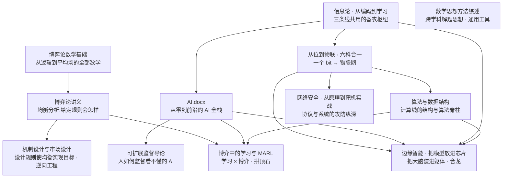

# 图书馆 · Library

> 一座**自建的长文档知识库**——不是松散的资料堆，而是一条经过设计的路线：**数学 → 计算系统 → AI → 博弈与设计**。各书之间"**馆内只教一次**"，后书直接回指前书、零前置缺口，像一套相互咬合的教材而非彼此孤立的综述。

多为 AI 辅助生成、经人工校订的长篇 `.docx`；**数学类文档的公式均为 Word 原生公式（OMML）**，可在 Word / WPS 中双击编辑，而非图片或纯文本。

合计约 **370 万字** · **12 部文档** · **8.2 万余个内嵌公式**。

---

## 🗺️ 全馆路线

各书沿三条主线展开，并在交汇处焊接：

- **博弈与设计线**：`博弈论数学基础`（打地基）→ `博弈论讲义`（分析均衡）→ `博弈中的学习与 MARL`（把学习装进博弈）/ `机制设计与市场设计`（反过来：设计规则使均衡实现目标）。
- **计算 · 工程线**：`从位到物联 · 六科合一`（从一个比特连续构建到物联网，六门工科熔成一条栈）→ `算法与数据结构`（补上六科自陈的"数据结构未独立成科"缺口，每个结构/算法给"证明+复杂度+可运行实现"三件套，是各书算法实现的功底）→ `边缘智能 · 把模型放进芯片`（把 AI 模型压缩部署进 MCU，是"躯体"与"大脑"的工程合龙）。
- **AI 线**：`AI.docx`（机器学习到大模型的全栈）。
- **隐藏枢纽**：`信息论 · 从编码到学习`（熵这套语言同时托起通信编码、机器学习损失与博弈中的信息价值，是三条线共用却各书只各讲一面的香农底座）。
- **交汇与方法**：`博弈中的学习` 把上面三条线在"学习 + 博弈"处焊成一体；`可扩展监督导论` 补上"人如何监督自己看不懂的 AI"这一方法论缺口。
- **通用工具**：`数学思想方法综述`（贯穿各书的解题思想）。

> 图书馆仍在沿这条路线持续扩展。

---

## 📚 目录

| 文档 | 在路线中的角色 | 规模 | 内嵌公式 | 大小 |
|------|------|------|:---:|:---:|
| [博弈论数学基础.docx](博弈论数学基础.docx) | 博弈线的**数学地基** | 约 34 万字 · 21 章 / 4 卷 | 16,876 | 2.3 MB |
| [博弈论讲义.docx](博弈论讲义.docx) | 博弈线的**均衡分析** | 约 85 万字 | 14,524 | 2.1 MB |
| [博弈中的学习与多智能体强化学习.docx](博弈中的学习与多智能体强化学习.docx) | 三线交汇的**拱顶石** | 约 35 万字 · 20 章 / 4 卷 | 12,558 | 1.1 MB |
| [机制设计与市场设计.docx](机制设计与市场设计.docx) | 博弈线的**设计侧**（逆向工程） | 约 35 万字 · 17 章 / 4 卷 | 12,466 | 0.81 MB |
| [从位到物联_六科合一_全书.docx](从位到物联_六科合一_全书.docx) | 计算工程线的**全栈脊柱** | 约 59 万字 · 31 章 / 4 卷 | 8,306 | 2.6 MB |
| [算法与数据结构.docx](算法与数据结构.docx) | 计算线的**结构与算法脊柱**（三件套） | 约 22 万字 · 17 章 / 4 卷 | 6,857 | 0.71 MB |
| [网络安全_从原理到靶机实战.docx](网络安全_从原理到靶机实战.docx) | 协议与系统的**攻防纵深**（授权实操） | 约 22 万字 · 22 章 / 5 卷 | 59 | 0.52 MB |
| [信息论_从编码到学习.docx](信息论_从编码到学习.docx) | 三条线共用的**香农枢纽** | 约 18 万字 · 13 章 / 3 卷 | 7,511 | 0.51 MB |
| [边缘智能：把模型放进芯片.docx](边缘智能：把模型放进芯片.docx) | 躯体×大脑的**工程合龙**（TinyML） | 约 14 万字 · 11 章 / 3 卷 | 568 | 0.40 MB |
| [AI.docx](AI.docx) | AI 线的**全栈纵览** | 约 17 万字 · 16 章 | 787 | 0.30 MB |
| [可扩展监督导论——非专家的AI验证方法.docx](可扩展监督导论——非专家的AI验证方法.docx) | 人机协作的**方法论** | 约 19 万字 · 7 章 | — | 0.42 MB |
| [数学思想方法综述_公式版.docx](数学思想方法综述_公式版.docx) | 跨学科的**通用工具** | 约 16 万字 | 1,010 | 0.27 MB |

---

## 📖 文档简介

### 博弈论数学基础
**全馆公式最密集的一部（16,876 个），也是整条博弈线的承重墙。** 多数博弈论教材默认读者已备好所需数学却从不讲它；本书反其道而行——副标题"从形式基础到平均场前沿"，从形式逻辑一路往上，**亲手浇筑博弈论暗中依赖的全部数学**，21 章 / 4 卷、约 34 万字。其结构本身就是一条由抽象到前沿的攀登：

- 卷一 · 形式基础与三大支柱：数理逻辑与证明方法、集合关系与函数、初等组合与计数、线性代数、多元微积分、初等概率。
- 卷二 · 分析、凸性与优化引擎：实分析与度量空间、凸分析、点集拓扑与不动点定理、非线性规划与 KKT、线性规划与对偶。
- 卷三 · 概率深化、动力系统与序格：测度论概率、随机过程、常微分方程与 Lyapunov 稳定性、偏序/格/Tarski 与 Topkis。
- 卷四 · 离散计算与连续时间前沿：组合数学与图论、计算复杂性（PPAD / 无悔学习）、最优控制与变分法、偏微分方程（HJB / Fokker–Planck / 粘性解）、随机分析（Itô / SDE）、平均场博弈（MFG）。

### 博弈论讲义
**全馆体量最大的单卷（约 85 万字，14,524 个公式）。** 如果说《博弈论数学基础》提供工具，本书就是用这套工具回答博弈论的核心追问——**给定一组规则，理性的参与者会落在哪个均衡**。它系统铺陈从博弈建模到均衡分析的完整体系，是理解"分析侧"的主干；其下游正是《博弈中的学习》（当参与者会学习时，均衡如何动态地达成或失稳）。

### 博弈中的学习与多智能体强化学习
**全馆的拱顶石——三条线在此合龙。** 它把《博弈论数学基础》的数学、《博弈论讲义》的均衡理论、《AI.docx》的深度学习栈，在"**学习 × 博弈**"的交汇点焊成一体，20 章 / 4 卷、约 35 万字、12,558 个原生公式，并以 **17 条承重定理全证**回答一个统一问题：**当多个会学习的智能体相互作用时，会收敛到什么、为什么、怎么算**。全书站在馆藏三书之上，馆内只教一次、零前置缺口。

- 卷一 · 在线学习与遗憾（第 1–4 章）：专家建议与乘性权重（MW/Hedge）、在线凸优化（OGD/FTRL/镜像下降）、多臂老虎机（UCB/Thompson/EXP3）。
- 卷二 · 博弈中的学习（第 5–9 章）：虚拟博弈、无悔学习→粗相关/相关均衡、遗憾匹配与 CFR、学习动力学的收敛与不收敛、零和博弈的最优化解法。
- 卷三 · 强化学习（第 10–15 章）：MDP 与贝尔曼方程、动态规划、无模型方法（MC/TD/Q-learning）、深度 RL、策略梯度与信赖域、样本复杂度与探索。
- 卷四 · 多智能体（第 16–20 章）：随机博弈（Shapley 值迭代）、MARL 范式（CTDE/值分解/MAPPO）、通信与信用分配、平均场 RL、LLM 智能体与博弈。

### 机制设计与市场设计
**博弈论的逆向工程——博弈线缺失的另一半。** 《博弈论讲义》分析"给定规则会落在哪个均衡"，本书反问"想让某结果成为均衡、该设计什么规则"，17 章 / 4 卷、约 35 万字、12,466 个原生公式。设计者的问题一以贯之：在**激励相容（IC）/ 个体理性（IR）/ 可行性**三类约束下实现目标；**显示原理**是贯穿全书的元工具。全书 IC/IR 约束显式写成不等式、每个机制配规则框 + 完整数值算例，数学工具直接回指馆藏《博弈论数学基础》《从位到物联》（Gale–Shapley），馆内只教一次。

- 卷一 · 社会选择与机制设计基础（第 1–4 章）：Arrow 与 Gibbard–Satterthwaite 不可能定理、显示原理、VCG 机制。
- 卷二 · 拍卖理论（第 5–8 章）：四大拍卖与收益等价、Myerson 最优拍卖、组合拍卖、Myerson–Satterthwaite 双边交易不可能。
- 卷三 · 无钱市场：匹配与分配（第 9–12 章）：稳定匹配的格结构与延迟接受（DA）、顶点交易循环（TTC）、学校选择、公平分割（租金分割与 Sperner）。
- 卷四 · 信息·合约·计算（第 13–17 章）：贝叶斯说服与信息设计、委托代理合约、算法机制设计、市场设计工程学与设计者工具箱总图。

### 从位到物联_六科合一_全书
**一次"拆掉学科墙"的实验，全馆体量第二（约 59 万字、8,306 个原生公式）。** 离散数学、数字逻辑、计算机、单片机、网络、物联网通常是六本书、六门考试；本书主张这些边界是行政的而非真实的——底下只有**一条从"位（bit）"连续攀升到"物联网"的技术栈**。于是它把六科熔成一条主线，跨学科的公共模块（数制、状态机、图论、编码…）只在归属章讲一次、各科按需回指：

- 卷一 · 公共地基与离散工具库（第 1–8 章）：数制与数据表示、布尔代数、组合计数与计算复杂度、有限状态机与自动机、图论与图算法、数论与有限域编码等离散数学工具。
- 卷二 · 数字逻辑与计算机系统脊柱（第 9–18 章）：组合/时序逻辑、存储器与时序、PLD/FPGA、指令集（ISA）、数据通路与 CPU、流水线、Cache 与存储层次、I/O 与中断、操作系统基础。
- 卷三 · 单片机与数据通信桥梁（第 19–23 章）：MCU 架构、GPIO、外设与通信。
- 卷四 · 网络与物联网前沿：从数据通信走向物联网应用。

### 算法与数据结构
**计算线的结构与算法脊柱，补上六科自陈的缺口（约 22 万字、17 章 / 4 卷、6,857 个原生公式）。** 《从位到物联》在终章自承"数据结构未能独立成科"，本书补上这一块并立成脊柱。它不是结构罗列，而有一条贯穿全书的**三件套纪律**：每个数据结构 / 算法都交出**正确性证明 + 复杂度证明 + 可运行实现**，且**每项给可编译 C 与可运行 Python 双实现**、注释不变量。CLRS 式严谨配 Sedgewick 式工程感，面向研究生 / 408 水平，每章末附 408 综合题型框。

- 卷一 · 基础结构与分析（第 1–4 章）：摊还分析三法（聚合 / 记账 / 势能）、线性表与栈队列、字符串匹配（KMP）、树与遍历、Huffman 编码。
- 卷二 · 查找与排序（第 5–9 章）：BST→AVL→红黑树→B 树的平衡演进、散列与布隆过滤器（期望分析）、快排期望、排序下界、选择与中位数的中位数。
- 卷三 · 图算法与设计范式（第 10–14 章）：BFS/DFS 定理、拓扑排序、强连通分量（Tarjan）、最短路、最小生成树、网络流（Dinic）、分治、动态规划、贪心与拟阵。
- 卷四 · 极限与应对（第 15–17 章）：NP 完全性与归约实战（回指《博弈论数学基础》P/NP 框架）、近似（2-近似）/ 随机化（Karger）/ 启发式、算法工程学与全书综合。

### 网络安全_从原理到靶机实战
**协议与系统的攻防纵深，伦理边界内的实操教材（约 22 万字、22 章 / 5 卷）。** 《从位到物联》把读者带到"理解协议/系统"，本书是它的攻防纵深——同一套网络栈与系统，从攻击者与防御者两个视角各看一遍，每个漏洞讲清"为什么存在、怎么利用、怎么防"。**面向授权渗透测试、CTF 与防御**，全书贯穿四条红线：授权与隔离声明、**攻防对称（每个攻击紧跟防御对照框）**、不越武器化红线（不输出可打在野系统的 exploit、不教检测规避、不收 0day）、命令真实但环境值（IP/哈希/flag/CVE）一律占位不编造。脊柱是 PTES 式渗透生命周期，协议/系统底座回指《从位到物联》、馆内只教一次。

- 卷一 · 实验室与方法论（第 1–3 章）：杀伤链与 ATT&CK、搭建隔离靶场（全书实操底座）、PTES/OSSTMM 与授权范围 RoE。
- 卷二 · 侦察与网络攻防（第 4–7 章）：OSINT、Nmap 扫描机理、Wireshark 与 ARP 欺骗/中间人、网络层攻击。
- 卷三 · Web 应用安全（第 8–12 章）：Burp/OWASP、SQL 注入与命令注入、XSS/CSRF/SSRF、认证会话与 LFI/上传、进阶 Web。
- 卷四 · 系统攻防与后渗透（第 13–18 章）：密码学攻击、二进制栈溢出与缓解机制、Linux/Windows 提权、Metasploit 全链路、后渗透（蓝队检测视角）。
- 卷五 · 防御、专题与综合（第 19–22 章）：蓝队检测工程、加固与纵深防御、IoT/无线/云专题、综合实战 capstone（完整 kill-chain + 渗透报告）。

### 信息论_从编码到学习
**三条馆藏线共用的隐藏枢纽（约 18 万字、13 章 / 3 卷、7,511 个原生公式）。** 《从位到物联》在讲 CRC 与纠错码、《AI.docx》在讲交叉熵与信息瓶颈、《博弈论讲义》在讲信息的价值——本书论证它们站在同一个人肩上：**1948 年香农以"熵"为核心的语言，成了度量不确定性与信息量的通用货币**。全书脊柱是一条从"度量"到"极限"再到"枢纽"的主线，每个定理都标注馆藏落点、馆内只教一次、三态（完整证明 / 陈述见文献 / 直觉示意）不混。

- 卷一 · 度量信息：熵的世界（第 1–4 章）：熵 / 联合熵 / 条件熵的公理化、互信息与 KL 散度、数据处理不等式与 Fano 不等式、渐近均分性（AEP）与典型序列。
- 卷二 · 香农三大定理：编码的极限（第 5–9 章）：信源编码（Kraft 不等式、Huffman 最优性）、信道容量与信道编码定理、微分熵与 AWGN 容量及注水定理、率失真 R(D)、网络信息论（Slepian–Wolf）。
- 卷三 · 两翼延伸：信息论作为枢纽（第 10–13 章）：信息论 × 统计（假设检验 / Stein 引理 / 最大熵 / MDL）、× 机器学习（交叉熵 / 信息瓶颈 / 泛化）、× 博弈与经济（信息的价值 / 信道作为承诺），终章以 Kolmogorov 复杂度收口。

### 边缘智能：把模型放进芯片
**"躯体"与"大脑"的工程合龙（约 14 万字、11 章 / 3 卷）。** 《从位到物联》给出躯体（MCU / 传感器 / 协议），《AI.docx》给出大脑（模型），本书合上两书都没合的那道缝——**怎么把一个动辄数 MB 的模型，真正装进只有几百 KB SRAM、靠电池供电的芯片里**。论点一以贯之：边缘不是"缩小版的云"，而是延迟 / 功耗 / 内存 / 隐私四条物理约束逼出的重新设计。**重动手是生命线**——每个机制都配最小可跑代码，性能一律实测填表、绝不编造；三态（本书方法 / 实现因平台而异 / 简化示意）诚实标注。

- 卷一 · 约束与压缩：让模型变小（第 1–4 章）：四大约束与资源账本（Flash/SRAM/FLOPs 核算）、量化深讲（定点数学与 INT8 推理，讲到能手算）、剪枝 / 知识蒸馏 / 低秩分解。
- 卷二 · 推理引擎与工程（第 5–8 章）：剖析 TFLite Micro 与 CMSIS-NN、一个完整的 KWS 关键词唤醒项目走通"训练→转换→量化→烧录→四维实测"、音频 / 视觉 / IMU 三类传感器、DSP/NPU/GPU/FPGA 加速硬件谱系。
- 卷三 · 协同与收官（第 9–11 章）：端-边-云协同（任务切分 / MQTT / OTA，回指《从位到物联》）、联邦学习与隐私（FedAvg 一轮手算），终章 capstone 给温湿度 IoT 系统装上异常检测的"大脑"，端侧推理 + 云端再训练 + OTA 下发闭环。

### AI.docx
**一部从零到前沿的全栈纵览**——《从零到前沿：人工智能、大模型、机器学习、深度学习与神经网络全栈知识体系》，约 17 万字、16 章。它把整张 AI 地图按一条上升路线铺开：数学基础 → 优化与数值 → 经典机器学习 → 神经网络 → 深度学习架构 → Transformer 与大模型 → 训练对齐 → RAG 与智能体 → 多模态 → 生成模型（VAE/GAN/Flow/Diffusion）→ 强化学习 → MLOps 与治理。**公式专业排版版**：全书 787 处公式均为 Word 原生公式；其中强化学习的 Bellman 方程、GAN/VAE/WGAN 目标、扩散损失、交叉熵、策略梯度等曾被生成器损坏（公式主体被引用编号 `[13]`、`[4]` 等替换）的部分，已按标准形式逐一重建并独立复核。

### 可扩展监督导论——非专家的AI验证方法
**全馆唯一的方法论 / 人侧技能读本，也是最反直觉的一部。** 副标题 *Introduction to Scalable Oversight — The Non-Expert's Approach*，约 19 万字、7 章。它推翻一个常识——主张**外行能够监督自己看不懂的 AI 产出**，办法是把不可理解的断言**翻译成可观察的现象**：验证 ≠ 理解；外行手里有三种不依赖领域知识的硬通货——**现实 / 一致性 / 目标**；并配一套**六步领域无关动作集**作实操内核。它是 ARBITER-UPRK 协议的**人侧对偶**，刻意不堆公式（故内嵌公式为 0）。

- 第 1–3 章：核心框架（脊柱章）→ 问题根源（为何不能直接信 AI：幻觉 / 谄媚 / 自纠失败，与人的"知识的诅咒"）→ 理论地基（验证为何远便宜于理解：P/NP 直觉与证明者-校验者博弈）。
- 第 4 章：AI 侧范式——把 debate / iterated amplification / weak-to-strong / prover-verifier 翻译成"小白可执行版"。
- 第 5 章（实操核心）：人侧六步动作集（角色反转 / 预测前置 / 验收外包 / 矛盾三角测量 / 递归分解 / 残差显式化），逐一配真实案例与可直接抄用的模板。
- 第 6–7 章：前端的意图定义与提示（验收先行）→ 教学法（把验证者角色当可迁移技能来训练，含给教师的练习设计与评估 rubric）。

### 数学思想方法综述_公式版
**不是又一本知识教材，而是一部"元教材"。** 《高等数学、线性代数、概率论与数理统计及离散数学中的数学思想方法综述》，约 16 万字——它不复述定理，而是抽取**贯穿高数 / 线代 / 概率统计 / 离散的可迁移思想方法**（化归、构造、对偶、不变量、递推…），即解题者真正反复复用的那层"招式"。**公式专业排版版**：全书 1,010 处公式（组合恒等式、积分公式、向量微积分、级数判别等）已逐一校订为 Word 原生公式，无残缺、无原始 LaTeX 残留。

---

## 🧭 如何阅读本馆

- **想学博弈论**：先《博弈论数学基础》补数学 → 《博弈论讲义》学均衡 → 《博弈中的学习与 MARL》进动态与多智能体前沿。
- **想学 AI / 计算机系统**：《AI.docx》纵览全栈；《从位到物联》打底层硬件与网络；想把模型真正落到芯片上，接《边缘智能：把模型放进芯片》（TinyML 压缩→部署→端边云）；两者在《博弈中的学习》的深度 RL 与《可扩展监督导论》处交汇。
- **想要打通编码 / 学习 / 信息的底座**：《信息论：从编码到学习》——从熵到香农三大定理，再延伸到统计、机器学习、博弈，是看清"为什么三条线都站在香农之上"的枢纽。
- **只想要可迁移的方法**：《可扩展监督导论》（如何监督看不懂的 AI）、《数学思想方法综述》（如何解题），两本都不预设深厚背景。

## ℹ️ 说明

- 数学类 `.docx` 的公式均为 **Word 原生公式对象**（OMML），可在 Word / WPS 中双击编辑；方法论 / 教学型文档（如《可扩展监督导论》）以正文为主、公式从简（表中以 `—` 标注）。
- 字数为正文中文字符的近似统计；公式数为文档内嵌公式对象的精确计数；本表数字均为各书实测，不含臆造。
- 文档体量较大，建议**下载到本地用 Word / WPS 打开**（网页预览对原生公式支持有限）。
